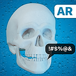

  
  <h1 align="center">Skull Shower An Augmented Reality Experiment</h1>

This is an experiment built with ARKit and Scene Kit.

## The app:

In the app you have a buddy which is a skull, and there is a constant rain on top of it. But, what you would have not expected, is that this little skull hates bathing, so it will speak some mean lines to you.

All the audio files where generated with [lovo.ai](https://www.lovo.ai).

  

